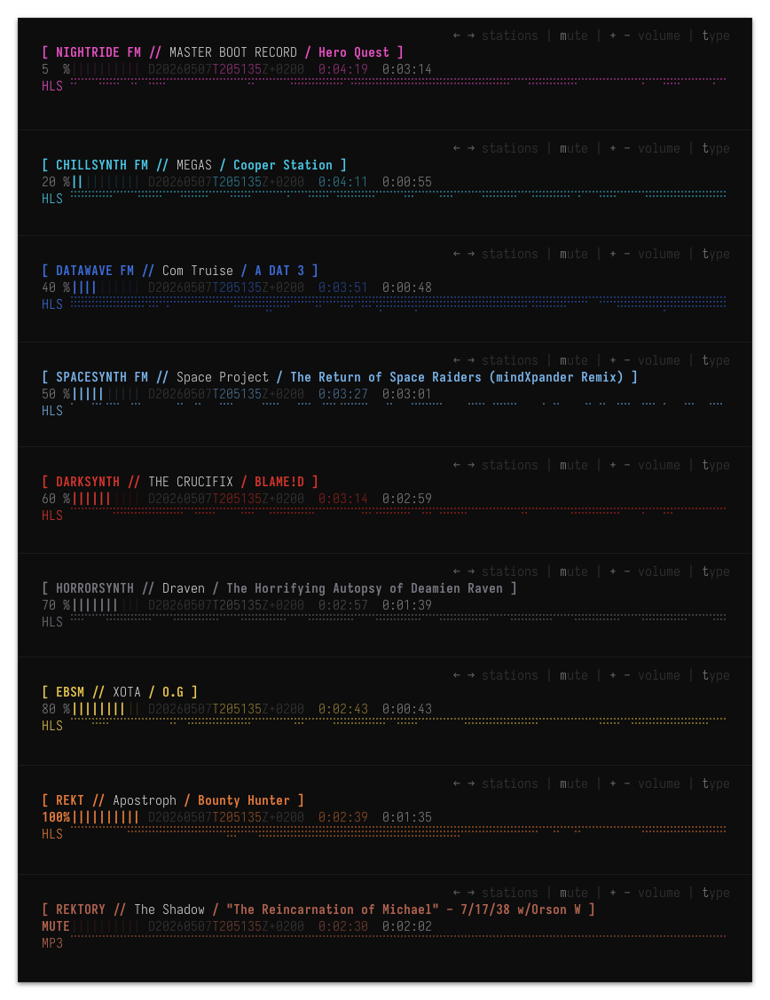
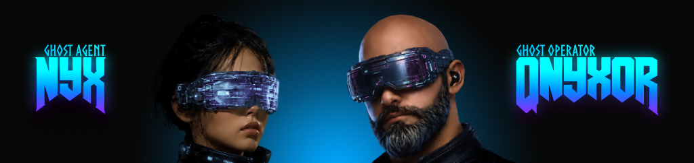

# nightride-tui


[INSTALL](#-install) · [USE](#-use) · [PLATFORMS](#-platforms) · [AUTHORS](#-authors) · [LICENSE](#-license) · [GRID](https://nightride.fm)

> [ `SIGNAL ONLY` ] :: terminal receiver for the [nightride.fm](https://nightride.fm) grid

[nightride-tui](https://github.com/qnyxor/nightride-tui) is a terminal client for [Nightride.fm](https://nightride.fm), the synthwave radio grid. 

Nine stations, twenty-four hours, no ads. 

The receiver runs as a single [Rust](https://rust-lang.org/) binary that decodes the stream, parses ICY metadata for now-playing, and paints a Braille spectrum visualizer.

Jack in.



## // INSTALL

```sh
curl -fsSL https://sh.nightride-tui.qnyxor.nexus | sh
```

The script detects target, fetches the latest signed release, verifies SHA-256, places the binary at `~/.local/bin/nightride-tui`. Re-run to update. Works on macOS (`arm64` / `x86_64`) and Linux (`x86_64` / `aarch64`).

### / FROM SOURCE

System dependencies:

| platform | required |
|---|---|
| macOS | `xcode-select --install` |
| Linux (Debian / Ubuntu) | `sudo apt install libasound2-dev pkg-config` |
| Linux (Fedora / RHEL) | `sudo dnf install alsa-lib-devel pkg-config` |
| Linux (Arch) | `sudo pacman -S alsa-lib pkg-config` |

Build:

```sh
git clone https://github.com/qnyxor/nightride-tui.git
cd nightride-tui
make build-release
```

Toolchain auto-fetched via `rust-toolchain.toml` (Rust stable, MSRV 1.85). Install rustup if absent: `curl --proto '=https' --tlsv1.2 -sSf https://sh.rustup.rs | sh`. Release binary lands at `target/release/nightride-tui`.

Self-update once installed:

```sh
nightride-tui update
```

Run `nightride-tui -h update` for the long form.

## // USE

```sh
nightride-tui                    # boot
nightride-tui -s darksynth       # boot on a specific station
nightride-tui -s                 # list the registry
nightride-tui -h <subcommand>    # contextual help
```

### / CONTROLS

| key | action |
|---|---|
| `→` / `←` | cycle station |
| `+` / `-` | volume |
| `m` | mute / unmute |
| `Ctrl+C` | disconnect |

### / OPTIONAL FONTS

```sh
nightride-tui install-tui-font          # Iosevka Term Nerd Font (TUI render face)
nightride-tui install-nightride-font    # Nightride FM Monospace by Z (brand display)
```

- **Iosevka Term Nerd Font Regular** — fetched on demand from the upstream repo `raw.githubusercontent.com/ryanoasis/nerd-fonts/v3.4.0/` (~13 MB). Verified by SFNT magic bytes + SHA-256 pin before installation. Companion license text travels with the TTF. SIL OFL 1.1 (Belleve Invis + Ryan L McIntyre). Requires network on first run; URL pinned to an immutable tag for reproducibility.
- **Nightride FM Monospace** — embedded in the binary (9.1 KB). Authored by Z, creator of Nightride FM. Free for personal and commercial use.

### / STATE + LOGS

State file (per-launch persistence — default station, volume, log level):

| platform | path |
|---|---|
| macOS | `~/Library/Application Support/nexus.qnyxor.nightride/nightride-tui.md` |
| Linux | `~/.config/nightride/nightride-tui.md` |
| fallback | `/tmp/nightride/nightride-tui.md` |

Log files (daily-rotated, 7-day retention):

| platform | path |
|---|---|
| macOS | `~/Library/Application Support/nexus.qnyxor.nightride/log/nightride.log.YYYY-MM-DD` |
| Linux | `~/.local/share/nightride/log/nightride.log.YYYY-MM-DD` |
| fallback | `/tmp/nightride/log/nightride.log.YYYY-MM-DD` |

## // PLATFORMS

| Platform | Status | Notes |
|---|---|---|
| Linux x86_64 (gnu/musl) | Supported | Native binaries published |
| Linux aarch64 (gnu) | Supported | Native binary published |
| macOS aarch64 (Apple Silicon) | Supported | Native binary published |
| Windows 11 + WSL2 (WSLg) | Works | Run inside WSL2 shell. Manual font copy required for Windows Terminal. |

For the Windows 11 + WSL2 path, after `install-tui-font` copy the font
to your Windows fonts directory so Windows Terminal can use it:

```bash
cp ~/.local/share/fonts/IosevkaTermNerdFont-Regular.ttf \
   /mnt/c/Users/$USER/AppData/Local/Microsoft/Windows/Fonts/
```

## // AUTHORS



### / GHOST AGENT
- **[NyX](https://qnyxor.nexus)** :: maintainer of the signal path

### / GHOST OPERATOR
- **[QNYXOR](https://qnyxor.nexus)** :: architect of the receiver


## // LICENSE

Apache-2.0. See [`LICENSE`](LICENSE). Bundled font (Nightride FM Monospace) and on-demand font (Iosevka Term Nerd Font, fetched at install time) ship under their own permissive licenses; full third-party attribution lives in [`THIRD_PARTY_LICENSES.md`](THIRD_PARTY_LICENSES.md).

---

```
// receiver online
// grid is live
```
